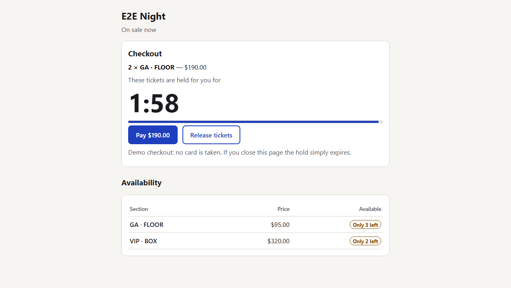
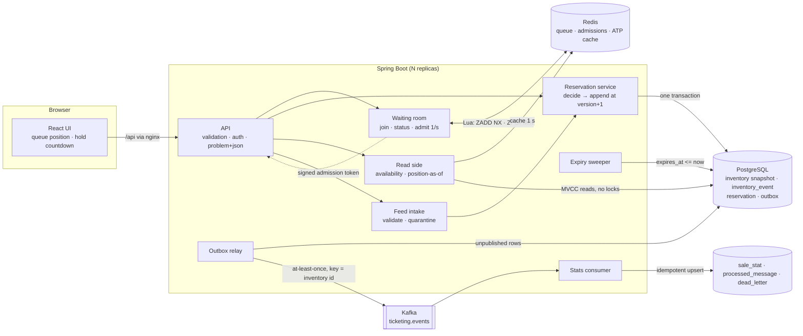
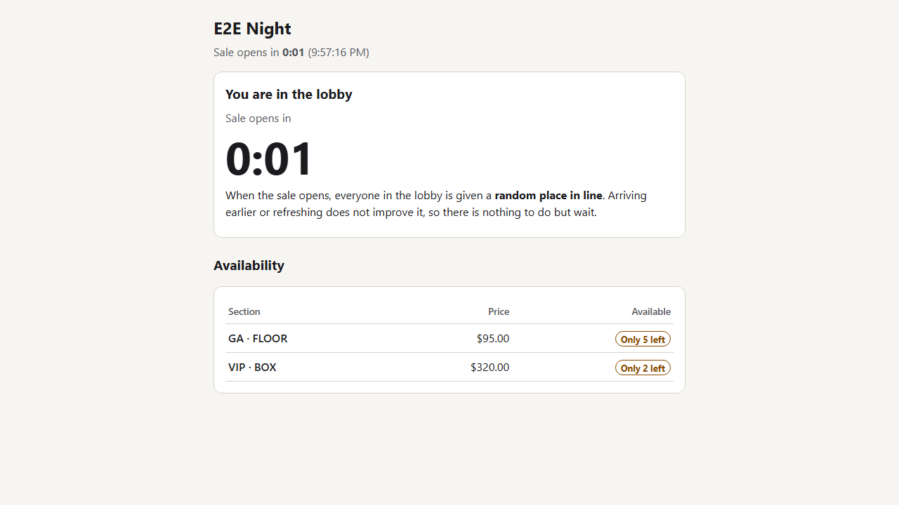
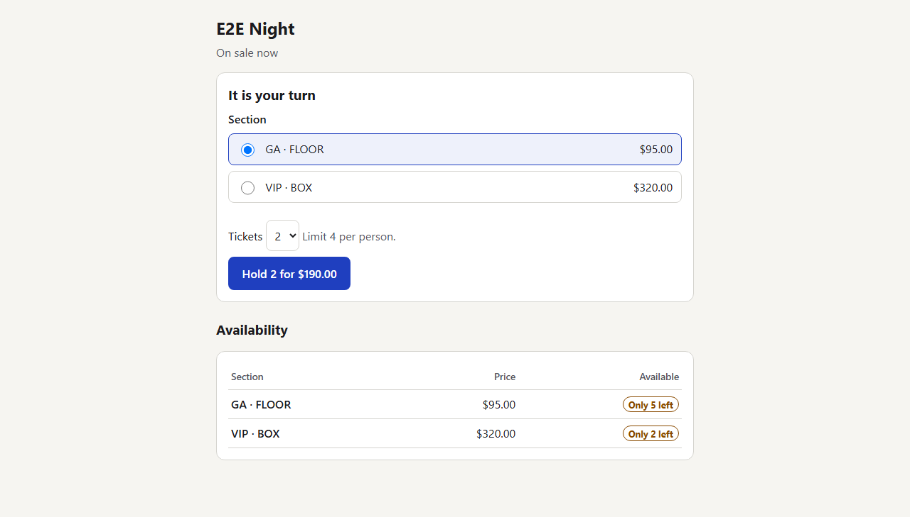
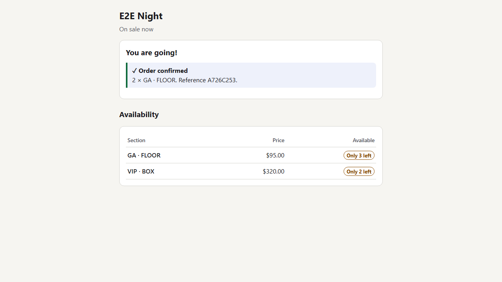
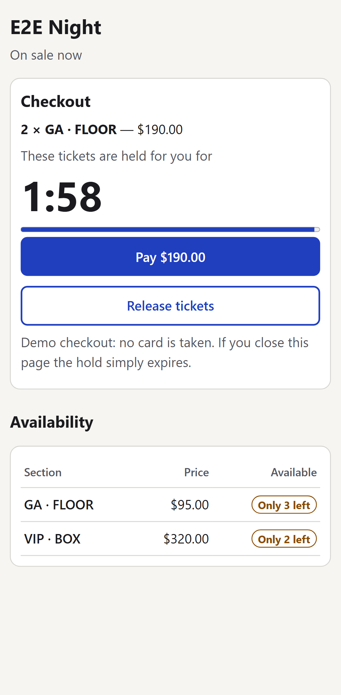

# The Last Ticket

Ten thousand people hit refresh for twelve hundred tickets at exactly 10:00:00. Nobody gets oversold, and nobody sees a
spinner forever.

Stock changes and reservations are events applied to per-inventory aggregates with optimistic version checks. A virtual
waiting room throttles admission, an available-to-promise projection serves reads, and an expiry sweeper releases
abandoned holds.

Java 17 · Spring Boot 3.5 · PostgreSQL 16 · Kafka 3.9 · Redis 7 · React 19 · TypeScript · Docker · Kubernetes



## Run it

Needs Docker with Compose v2. Nothing else.

```bash
cp .env.example .env
docker compose up --build
```

Open <http://localhost:3000>. A demo event with 1,200 tickets is seeded and goes on sale 60 seconds after first boot;
join the queue before then to see the lobby. API docs: <http://localhost:8080/swagger-ui>. Health and metrics:
<http://localhost:8081/actuator/health>, `/actuator/prometheus`.

If ports 3000 / 8080 / 8081 are taken, change `WEB_PORT` / `API_PORT` / `MGMT_PORT` in `.env`. Postgres, Redis and Kafka
are not published to the host. `docker compose down -v` removes everything including data.

To create another on-sale (the id makes it idempotent), then open `http://localhost:3000/?event=<id>`:

```bash
curl -X PUT http://localhost:8080/api/admin/events/$(uuidgen) -H 'X-Admin-Key: change-me-admin' -H 'Content-Type: application/json' -d '{
  "name": "Second night", "onSaleAt": "2030-01-01T10:00:00Z", "holdSeconds": 120, "maxPerUser": 4, "admissionRatePerSec": 50,
  "inventory": [{"ticketType": "GA", "section": "FLOOR", "priceCents": 9500, "total": 400}]}'
```

## Architecture



**A hold, step by step.** (1) The request carries a session token, an admission token from the waiting room, and an
`Idempotency-Key`. (2) A snapshot read refuses immediately if the section is sold out. (3) Otherwise the request takes
its turn for that section and, in one transaction: reads the aggregate, decides (pure code), runs
`UPDATE inventory … WHERE id = ? AND version = ?`, appends the event at `version + 1`, inserts the reservation with
`expires_at = now() + hold`, and writes an outbox row. (4) If another writer moved first the update matches 0 rows, the
transaction rolls back and is retried with backoff. (5) The relay publishes the outbox row to Kafka; the consumer folds
it into per-second statistics.

More: [decisions](docs/decisions.md) · [data dictionary](docs/data-dictionary.md) · [operations](docs/operations.md) ·
[performance](docs/performance.md) · [OpenAPI](docs/openapi.json) (generated from the code)

## The six requirements, and where the evidence is

| # | Requirement | How | Evidence |
|---|---|---|---|
| 1 | No oversell under concurrent reservations, proven by load test | Version-checked update + `UNIQUE (inventory_id, version)` + `CHECK (held + sold <= total)` | `loadtest/onsale.js`: 10,000 users / 1,200 tickets / 182,047 requests → **0 oversold**, stream replay = snapshot ([results](loadtest/results/summary-10000.txt)). `ReservationConcurrencyTest`: 400 simultaneous buyers for 60 tickets with the limiter opened up, ~200 version conflicts, 0 oversold. |
| 2 | Holds expire even if the client vanishes | Deadline is a column judged by the database clock; confirm requires `expires_at > now()`; sweeper expires in guarded per-hold transactions | `HoldLifecycleTest` (expired hold cannot be confirmed before the sweeper runs; swept exactly once). `FailureInjectionTest` (sweeper killed mid-expiry: nothing half-applied, next sweep expires once). E2E "abandoned checkout expires on screen and the tickets come back". Load test check "no hold outlived its deadline". |
| 3 | Fair admission, not fastest refresh | Lobby members get a random place when the sale opens; later arrivals are FIFO behind them; joining twice is a no-op; admission is rate-limited per event | `WaitingRoomTest`: first 20 to arrive are not the first 20 in line; 50 re-joins do not move you; 5/s admission is 5/s. |
| 4 | Availability reads never block on writers | Plain MVCC reads of snapshot rows behind a 1 s Redis cache; no read takes a lock or queues behind writers | Load test runs a constant-rate reader during the sale: p95 39 ms while holds are being placed ([results](loadtest/results/summary-1000.txt)). `WaitingRoomTest`: reads still served with Redis wiped. |
| 5 | Stock corrections and releases are events and do not break holds | `STOCK_ADDED` / `STOCK_CORRECTED` go through the same append path; a correction below held + sold is refused | `HoldLifecycleTest.stockCorrectionsAndReleasesAreEvents…`, `InventoryTest` (including a 60,000-step randomised invariant check). |
| 6 | Reconstruct the exact position at any past second | Position at T = sum of event deltas with `occurred_at <= T` | `HoldLifecycleTest.positionAtAnyPastInstantIsRebuiltFromTheStream`; `GET /api/admin/events/{id}/position?at=…`. |

## Tests

```bash
cd backend  && mvn verify                                   # 57 tests; needs Docker (Testcontainers: Postgres, Redis, Kafka)
cd frontend && npm ci && npm run lint && npm run typecheck && npm test   # 19 component tests
cd frontend && npx playwright install chromium && BASE_URL=http://localhost:3000 npm run e2e   # against the running stack
```

- **Unit**: the aggregate's decision rules and the feed parser (pure, no I/O).
- **Integration, real dependencies**: concurrency, expiry, idempotency, authorization, point-in-time reconstruction,
  outbox → Kafka → consumer, dead letters and replay, Redis loss, migration rollback and re-apply.
- **API**: success, validation failure, authorization failure and malformed input per endpoint (`ApiTest`).
- **Failure injection**: worker killed mid-expiry, mid-reservation, and between Kafka send and outbox mark.
- **End to end**: lobby → queue → hold → pay; abandoned checkout; keyboard-only purchase; at desktop and phone widths.
- Test data is created per test with fixed seeds; nothing depends on test order.

CI (`.github/workflows/ci.yml`) runs all of it on every push: `javac -Xlint:all -Werror`, ESLint with zero warnings,
`tsc --strict`, both test suites, both builds, then the E2E suite against the compose stack.

## Load test

```bash
docker compose --profile loadtest run --rm -e USERS=1000 -e VUS=500 -e ADMISSION_RATE=25 -e READ_RPS=50 k6
```

| 1,000 users, admission sized to this machine | p50 | p95 | p99 |
|---|---|---|---|
| place a hold (critical path; budget 100 / 400 / 800 ms) | 21 ms | 97 ms | 192 ms |
| availability read (budget – / 150 / 400 ms) | 3 ms | 39 ms | 127 ms |

At 10,000 users on the same laptop every correctness check passed and every latency threshold failed (hold p50 901 ms):
the machine was saturated. Both runs, the test bed, what was found and fixed along the way, and what breaks first at
10x are in [docs/performance.md](docs/performance.md).

## Data

There is no public feed of on-sale traffic, so `loadtest/generate-attempts.mjs` generates one, seeded, with the arrival
shape of an on-sale and its defects (type drift, dirty codes, three timestamp formats, missing fields, truncated lines,
duplicates, late delivery). [docs/data-profile.md](docs/data-profile.md) is the profile of that output.

```bash
node loadtest/generate-attempts.mjs --users 10000 --seed 42 --out data/generated/attempts.ndjson
node loadtest/profile-attempts.mjs data/generated/attempts.ndjson > docs/data-profile.md
curl -X POST "http://localhost:8080/api/admin/attempts/ingest?batchId=$(uuidgen)" -H 'X-Admin-Key: change-me-admin' \
     -H 'Content-Type: application/x-ndjson' --data-binary @data/generated/attempts.ndjson
```

Every line is stored verbatim, then validated; bad lines are quarantined with a reason
(`GET /api/admin/attempts/quarantine`); valid ones go through the same reservation path as live traffic.

## Deployment

Kubernetes manifests are in `deploy/k8s` (kustomize): a base, a production overlay that expects managed Postgres, Kafka
and Redis via Secrets, and a local overlay with stand-ins. Deploy, rollback and backup procedures:
[docs/operations.md](docs/operations.md).

**Status, stated plainly:** the system is not running on a public cloud. The deployment was verified end to end on a
local kind cluster (two backend replicas, migrations in an init container, full browser journey from outside the
cluster, a release that cannot start, a rollback). The transcript, including what did not go cleanly, is
[docs/deploy-verification.txt](docs/deploy-verification.txt).

## Screenshots

| Lobby | Your turn | Checkout | Confirmed | Phone |
|---|---|---|---|---|
|  |  |  |  |  |

Regenerate with `SCREENSHOTS=1 npm run e2e`.

## Limitations

- **Not deployed to a managed cloud.** Verified on kind with in-cluster stand-ins; the production overlay has not been
  applied to a real cluster with real managed services.
- **Latency numbers come from one busy laptop** that also ran the load generator. The 10,000-user run did not meet the
  latency budget. No measurement on production-like hardware exists.
- **One row per section is the throughput ceiling.** Roughly a hundred holds per second per section here. The change that
  lifts it is described, not built.
- **Payments are not implemented.** "Pay" confirms the hold.
- **No bot defence.** Sessions are anonymous and free: one person can open many sessions and take many places in line.
  Fairness is between sessions, not between humans; a real deployment needs verified accounts or proof-of-humanity
  before the lobby.
- **The queue is not durable.** If Redis loses its data, clients rejoin automatically but the order is lost.
- **Admission rate is fixed per event** and is not adjusted automatically when the write path is slow; over-admitting
  shows up as latency and retryable 503s (never as oversell).
- **Hold deadlines use the database clock; lobby/queue classification and displayed countdowns use the application
  clock.** Skew between them shifts when the sale appears to open by that amount.
- **`outbox` and `processed_message` are never pruned.**
- **Analytics trail the sale** by the outbox interval and are per-second totals; the point-in-time position endpoint
  returns sections, not individual reservations.
- **Admin authentication is a single shared key**, with no audit of who used it beyond the request correlation id.
- **Feed intake is synchronous**: one HTTP request per batch, 5 MB maximum.
- Two comments in migration V2 point at `docs/explain/*.txt` files that ended up as a single `docs/explain/plans.txt`
  (applied migrations are not edited).
