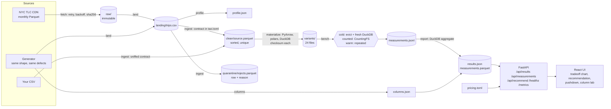

# The Compression Bake-Off

Codetober day 08: LAKE.

One CSV, written as 24 variants across CSV, Parquet, ORC and Avro, every codec, several
row-group and stripe sizes. A fixed query workload runs against each one and records wall
time (cold and warm), **bytes actually read from storage**, and read calls. A cost model
turns that into monthly cloud spend for a workload you describe.

<!-- RESULTS -->

## Run it

Needs Docker with Compose v2. Nothing else.

```bash
cd LAKE
docker compose up --build
```

Open <http://localhost:8000>. The image carries the published results in `results/`, so the
page works immediately.

To re-run the whole bake-off on your machine, inside the container:

```bash
docker compose --profile bench run --rm bench        # synthetic taxi-shaped data, ~2 min
```

Reload the page: it now shows your run ("run on this machine") instead of the published one.
To reproduce the published run on the real data (downloads 160 MB, takes about 1.5-2 hours):

```bash
cp .env.example .env    # then set LAKE_SOURCE=tlc
docker compose --profile bench run --rm bench
```

### On your own data

```bash
docker compose --profile bench run --rm -v /path/to/dir:/in:ro bench all --csv /in/yours.csv --sort-key event_time
```

Types are sniffed, unparseable lines are quarantined, and a four-query workload (count, full
scan, projection, 1% range filter on the sort key) is generated from the schema. For a
workload that means something, copy `bakeoff/taxi.toml`, which is the whole dataset
contract: columns, validation rules, queries.

### Without Docker

Python 3.11 and Node 22.

```bash
python -m venv .venv && . .venv/bin/activate      # Windows: .venv\Scripts\activate
pip install -e ".[dev]"
cp .env.example .env
python -m bakeoff all                              # or one stage at a time, below
(cd web && npm ci && npm run build)
python -m bakeoff serve
```

## Stages

`python -m bakeoff <stage>`. Each stage runs alone, and running it twice does nothing the
second time (inputs are fingerprinted).

| Stage | Reads | Writes |
|---|---|---|
| `fetch` | TLC CDN | `raw/*.parquet`, `raw/MANIFEST.json` (SHA-256). Immutable; a changed hash is an error |
| `land` | `raw/` or the generator | `landing/trips.csv`: the one big CSV, arrival order, defects intact |
| `profile` | landing CSV | `landing/profile.json`: sniffed types, nulls, cardinality, ranges |
| `ingest` | landing CSV + `taxi.toml` | `clean/source.parquet` (validated, deduplicated, sorted), `quarantine/rejects.parquet`, `clean/ingest.json` |
| `materialize` | clean | `variants/<id>/data.*`, each checksummed against the source |
| `bench` | variants | `results/measurements.jsonl` (append-only; resumes after a crash, retries only failed cells) |
| `columns` | generator | `results/columns.json`: one file per (column, format, codec) |
| `report` | all of the above | `results/results.json`, `results/measurements.parquet`; `--publish` copies both to `./results` |
| `docs` | code | `docs/openapi.json`, `docs/data-dictionary.md`, `docs/data-profile.md` |
| `serve` | results | API and UI on `LAKE_PORT` |
| `clean` | | deletes derived data; never `raw/` |

`--only REGEX` restricts `materialize` and `bench` to matching variant ids.

## Architecture



Module boundaries, one file each: `config.py` (environment, logging, stage timing),
`data.py` (fetch to ingest), `formats.py` (the matrix, writers, readers, the byte counter,
cache eviction), `bench.py` (materialize, runner, column lab), `report.py` (aggregation,
cost model, generated docs), `api.py`, `cli.py`.

Who reads what at query time, because every number is a property of the pair:

| Format | Written by | Read by | Projection pushdown | Predicate pushdown |
|---|---|---|---|---|
| Parquet | PyArrow | DuckDB native | yes | yes, by row-group statistics |
| ORC | PyArrow | PyArrow dataset, queried by DuckDB | yes | no: this reader never skips stripes |
| Avro | polars | polars decodes the file, DuckDB queries the result | no | no |
| CSV | DuckDB | DuckDB native, schema supplied | no | no |

## Method

For each (variant, query):

1. **Cold**, up to `LAKE_COLD_RUNS`: evict the file from the OS page cache, open a new
   DuckDB, time one execution.
2. **Counted**, once: the same execution through `CountingFS`, which counts every byte and
   read call the reader asks storage for. Not timed.
3. **Warm**: one connection, `LAKE_WARMUPS` discarded executions, then up to
   `LAKE_WARM_RUNS` timed.

A kind of run stops repeating once it has used `LAKE_CELL_BUDGET_S`, but never before 1 cold
and 2 warm. Medians are reported with min, max, standard deviation, coefficient of variation
and the run count. A timed execution covers binding the file, running the query and fetching
the result; for Avro that includes decoding the file, because there is nothing else to do
with Avro.

Whether cache eviction worked is measured in every run and published with it
(`env.eviction`). Read the caveat in [Limitations](#limitations) before quoting a cold number.

Every result is compared with the answer from `clean/source.parquet`. A mismatch marks the
cell failed and the run exits non-zero.

## Cost model

`POST /api/recommend` prices every variant for a described workload:

| Term | Formula |
|---|---|
| storage | variant bytes x scale x $/GB-month |
| scan (serverless) | bytes read per query (at least the provider's per-query minimum) x scale x $/TB |
| compute (self-hosted) | measured warm CPU-seconds per query x scale x $/vCPU-hour |
| requests | measured read calls per query x scale x $/1000 GET |
| write | measured encode CPU-seconds x scale x rewrites per month x $/vCPU-hour |

`scale` is your dataset size as CSV divided by the measured CSV size. Prices are in
`bakeoff/pricing.toml` with sources and a note on how each provider's row was verified;
`GET /api/pricing` returns the same file. Arithmetic is checked by hand-computed tests.

## API

Generated from the code: [`docs/openapi.json`](docs/openapi.json), or `/docs` on a running
server. CI fails if the committed file is stale.

| Endpoint | |
|---|---|
| `GET /api/results` | Everything the UI shows. `ETag` / `If-None-Match` |
| `GET /api/measurements?cursor=&limit=&variant=&query=` | Raw executions, keyset-paginated on `seq` |
| `POST /api/recommend` | Costed ranking for a workload. Pure: safe to retry |
| `GET /api/pricing` | Price table and sources |
| `GET /healthz` | Parses results, scans measurements, writes and reads a Parquet file. 503 if any fails |
| `GET /metrics` | Prometheus text: request counts and latency by route, results age |

Errors are always `{"error": {"code", "message", "details": [{"field", "problem"}], "request_id"}}`.
No authentication: see [DECISIONS.md](DECISIONS.md).

## Data

- [`docs/data-dictionary.md`](docs/data-dictionary.md): every column, unit, nullability, and
  every validation rule. Generated from `bakeoff/taxi.toml`.
- [`docs/data-profile.md`](docs/data-profile.md): the profile of the real landing CSV and
  what ingest did with it.

### Storage layout

```
$LAKE_DATA_DIR/
  raw/yellow_tripdata_YYYY-MM.parquet   write-once, hashed in MANIFEST.json
  landing/trips.csv                     regenerated from raw/
  clean/source.parquet                  zstd, 122,880-row groups, sorted on the sort key
  quarantine/rejects.parquet
  variants/<variant-id>/data.<ext>      one file per variant, on purpose
  results/                              measurements.jsonl -> measurements.parquet, results.json
```

One file per variant is the experiment's control, not a recommendation. What the
measurements say about a real layout is in the results section above: row groups far below
~100k rows multiply read calls without reducing bytes, and a single row group cannot be
pruned at all. For a real table that means: partition on the coarse filter (month), sort
within files on the fine one, aim for files of a few hundred MB with row groups around
100k-1M rows, and compact when appends leave you with files or row groups smaller than
that. None of that is built here.

## Configuration

Everything is an environment variable, documented in [`.env.example`](.env.example). There
are no secrets: the only external dependency is a public download.

## Tests

```bash
pytest                         # data, formats, measurement, cost model, API
(cd web && npm test)           # component tests, every UI state
(cd web && npm run e2e)        # Playwright, desktop and phone, against the real API
```

Nothing is mocked on the Python side: tests run real DuckDB, PyArrow, ORC and Avro on real
files, a real HTTP server for the retry tests, and the full pipeline on seeded synthetic
data with every defect injected. The system has no network service to put in a container,
so "integration against real dependencies" is the `image` CI job: build the image, serve
the published results, re-run the whole bake-off inside the container.

Failure injection covered: flaky and dead download source, tampered raw file, CSV that
breaks the contract, a writer that drops a row, a variant truncated on disk mid-run, a
wrong query answer, corrupt `results.json`, no results at all.

## Operations

**Deploy.** The deliverable is the image. `docker compose up --build -d` on any host, or
`docker build -t <registry>/lake-bakeoff:<tag> . && docker push` and run it with port 8000
published. It runs as a non-root user on a read-only root filesystem with all capabilities
dropped.

**Publish new results.** Run the bake-off, then `python -m bakeoff report --publish`, commit
`results/`, rebuild the image. The page shows the generation date and warns when results are
more than 180 days old.

**Rollback.** Results and code ship together in the image, so rolling back is running the
previous tag: `docker compose down && docker run -d -p 8000:8000 <registry>/lake-bakeoff:<previous>`.
A bad local run is discarded with `docker compose down -v`, which returns the page to the
published results.

**Backup.** The only state that cannot be regenerated is `raw/` (upstream could change or
remove a month) and `results/measurements.jsonl` (hours of machine time). Copy both:
`docker run --rm -v lake_lake-data:/data -v "$PWD":/out busybox tar czf /out/lake-data.tgz -C /data raw results`.
Restore by untarring into the volume. Everything else is rebuilt by `bakeoff all`.

**Observe.** JSON logs on stderr, one correlation id per CLI run or HTTP request (also
returned as `X-Request-ID`). Every stage logs duration and rows/s and warns when it exceeds
its budget. `/healthz` for liveness, `/metrics` for scraping.

**When things fail.**

| Failure | Behaviour |
|---|---|
| TLC download flaky | 5 attempts, exponential backoff capped at 30 s, then a message naming `LAKE_SOURCE=synthetic` |
| TLC returns 404 | No retry. Message names `LAKE_MONTHS` and `LAKE_TLC_BASE_URL` |
| Raw file changed on disk | Refused: raw is immutable |
| CSV does not match the contract | Ingest stops with the parser's message |
| Rows lost or invented in ingest | Ingest stops: accounting must balance |
| A variant does not hold the source rows | File deleted, run stops |
| A variant unreadable at bench time | That variant's cells are recorded as failed; the rest finish; exit code 1; UI shows "partial"; re-running retries only the failures |
| Interrupted run | Re-run the same command; it resumes |
| `results.json` missing / corrupt | API answers 404 `no_results` / 503 `results_unreadable`; UI shows an empty or error state with the fix |
| API unreachable from the UI | UI keeps showing the last copy it cached, labelled as saved |

## Limitations

- **One machine, one run.** A laptop, not a cluster; local NVMe, not object storage. Bytes
  and read calls are what DuckDB, PyArrow and polars asked a local filesystem for. An engine
  on S3 batches and prefetches differently, so read-call counts are an approximation of GET
  counts and the dollar figures are estimates, not invoices.
- **Cold runs are only as cold as the eviction check says.** On the published run's machine
  see `env.eviction` in the results and the "How this was measured" section of the page.
  Where eviction is not effective, cold and warm differ only by engine start-up.
- **Reader, not format.** ORC supports stripe statistics; the reader used here does not use
  them. Avro's numbers include a full decode by polars. Another engine would rank these
  differently.
- **Linear extrapolation.** The cost model scales a ~1 GB measurement to your size. Footer
  overheads shrink and row-group counts grow with scale; past a few hundred GB treat the
  ranking as the result and the dollars as indicative.
- **Query latency is not scaled** to the described dataset in the recommendation; it is the
  measured time on the benchmark data, used for ranking.
- **Write time is measured once**, single process, from memory.
- **Budgeted repetition** means slow cells (Avro, compressed CSV) have as few as 1 cold and
  2 warm runs. The run count is shown wherever a median is.
- **Not every price was verified.** See `pricing.toml`.
- **Changing benchmark code does not invalidate old measurements**; only a changed dataset
  does. After changing how something is measured, `bakeoff clean`.
- **Codec levels and encodings are barely explored**: zstd 3 and 19 for Parquet, defaults
  elsewhere, PyArrow's default encodings throughout.

### Ceiling

At 10x the data (95M rows, 10 GB as CSV) `materialize` breaks first: it holds the whole
dataset as one Arrow table (1.3 GB at today's size) and Avro and shuffled variants copy it.
The fix is streaming: `ParquetWriter` / `ORCWriter` fed by `duckdb ... fetch_record_batch`,
and dropping the shuffled control or shuffling within a bounded window. The Avro reader is
second: polars decodes the whole file into memory for every query. `ingest` is already
out-of-core (DuckDB with a temp directory) and `bench` only holds query results.

## Decisions

[DECISIONS.md](DECISIONS.md): what was chosen, what was rejected, what was deliberately not
built.
