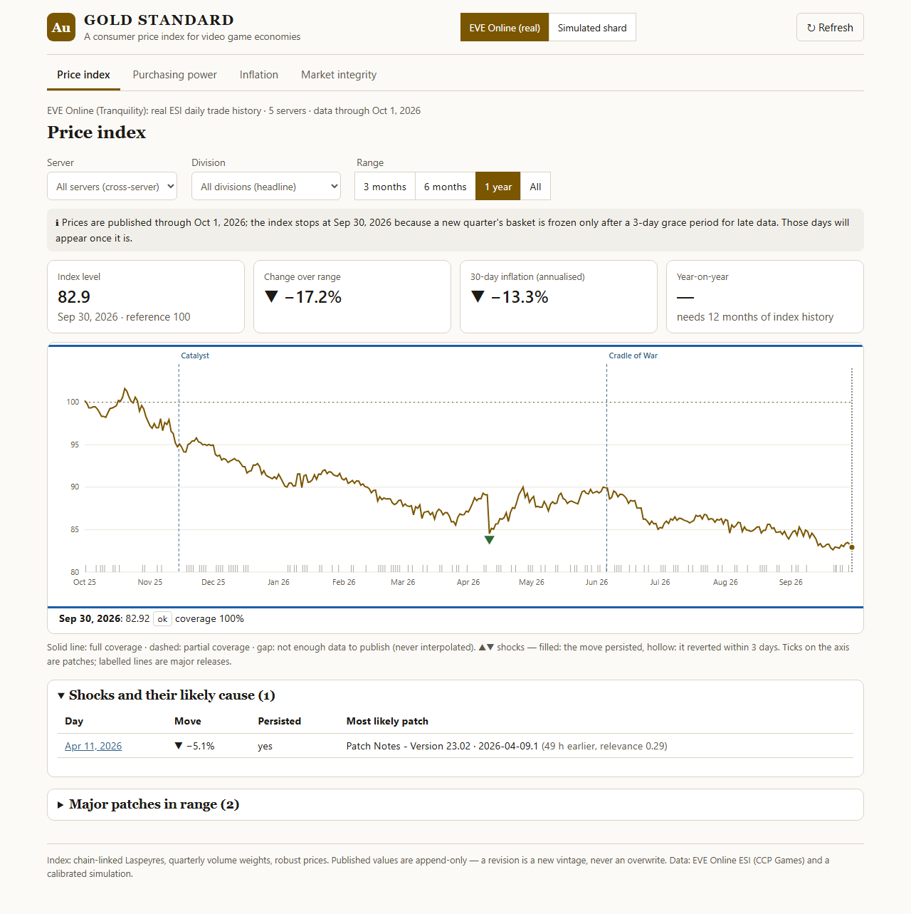
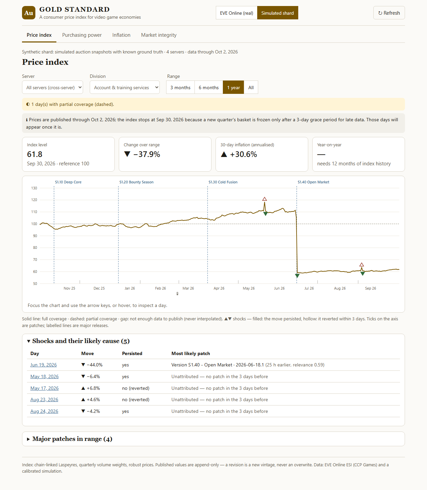
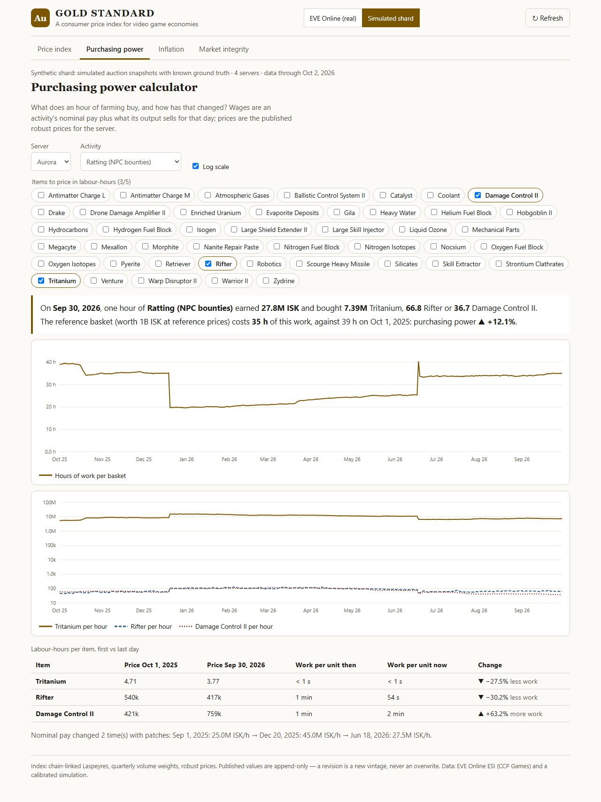
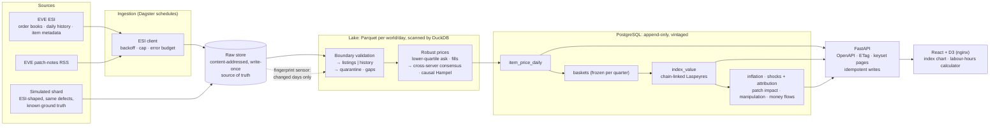

# GOLD STANDARD

**A consumer price index for video game economies: inflation, purchasing power, and the day a patch crashed the market.**

Auction-house data goes into a columnar store. A volume-weighted basket of goods then produces a
chain-linked Laspeyres price index per server and across servers. Robust estimators reject
manipulated listings, and patch notes are joined onto the timeline so a price shock can be
attributed to a specific change. It runs on **real EVE Online market data** (ESI) and on a
**calibrated simulated shard**, whose ground truth proves the estimators work.



| | |
|---|---|
|  |  |

## What it shows

* **The real EVE economy, Sep 2025 – Oct 2026:** <!--EVE_SUMMARY-->
* **The day a patch crashed the market:** in the simulated shard, patch *S1.40 "Open Market"*
  flooded PLEX supply. <!--CRASH_SUMMARY-->
* **Purchasing power in labour-hours:** a bounty-paid hour of ratting loses purchasing power to
  inflation, while a goods-paid hour of mining keeps it.
* **Manipulation, made visible:** the real Jita order book contains a Tritanium ask of 300,100,000
  ISK, about 7·10⁷× the market. A mean would have published it. The estimator ignores it, and the
  integrity view shows what a naive mean would have reported.

## Quickstart (one command)

Requirements: Docker with Compose v2. The first run builds the images and seeds about a year of data
for both worlds, which takes 10–20 minutes depending on the machine.

```bash
git clone <this repo> && cd TRANSFORM
cp .env.example .env            # change the passwords for anything but a laptop
docker compose up --build -d
docker compose logs -f seed     # watch the seed; the frontend starts when the API is healthy
```

| URL | What |
|---|---|
| http://localhost:8080 | The app (index, purchasing power, inflation, market integrity) |
| http://localhost:8000/docs | API reference, generated from code (OpenAPI) |
| http://localhost:3000 | Dagster: assets, partitions, schedules, sensors, backfills |

The seed is offline by default: it uses a committed snapshot of real ESI data
(`reference/fixtures/`). To fetch live EVE data as well, set `GS_SEED_ARGS=` in `.env`. After the
seed, the Dagster daemon keeps both worlds current on schedule.

## Architecture



Each (world, day) partition records a fingerprint of the raw inputs it was computed from. When a
late snapshot lands, or ESI revises a day, the sensor reprocesses exactly that day and its dependents.
Any value that changed is published as a **new vintage**. Nothing is overwritten: the published
tables reject UPDATE and DELETE at the database level.

## How the index works (short version; full spec in [docs/METHODOLOGY.md](docs/METHODOLOGY.md))

1. **One robust price per server, item and day.**
   * *Snapshots:* the interior lower quartile of the asks. One listing at any price can move it by at
     most one neighbouring order statistic, and a single bait listing can never be the estimate.
     Proven with property-based tests.
   * *Trade history:* the daily volume-weighted average.
   * *Either way:* a price more than 4× from the other servers' consensus is rejected. If too few
     servers traded the item, the price is checked against the cell's own accepted history
     (causal, so later data can't rewrite an earlier decision).
   * No price is ever fabricated. Thin and missing cells stay empty.
2. **A basket per quarter.** Weights come from the previous quarter's expenditure (price × traded
   volume), each item is capped at 20% within its server, and base prices are 7-day medians. Once
   built, the basket is frozen.
3. **Laspeyres, chain-linked** at each quarter boundary. A missing item's weight is carried by its
   own group's observed items, and coverage is published. Below 50% coverage no value is published.
4. **Shocks** are moves of at least 6 robust standard deviations, with persistence (did the move
   stick?). They are attributed to patches released in the 3 days before, scored by topic and
   recency, or reported as **unattributed**.

## Repository map

| Path | What |
|---|---|
| `src/goldstandard/sources/` | ESI client (retry/backoff/cap), EVE ingestion, simulated shard generator |
| `src/goldstandard/parse.py` | Boundary validation and quarantine for orders, history, wallet flows, patch RSS |
| `src/goldstandard/estimators.py` | Robust prices and day-level acceptance; the guarantees live here |
| `src/goldstandard/fills.py` | Trade inference from consecutive order books |
| `src/goldstandard/index.py` | Baskets, weights, chain links, Laspeyres aggregation |
| `src/goldstandard/analytics.py` | Inflation, shocks, attribution, patch impact, manipulation, sinks/faucets |
| `src/goldstandard/pipeline.py` | The processing graph as plain functions (Dagster and the CLI both call it) |
| `src/goldstandard/defs.py` | Dagster assets, partitions, sensors, schedules |
| `src/goldstandard/api/` | FastAPI: contract (`models.py`), routes, error handling |
| `migrations/` | Versioned SQL migrations, each with a tested rollback |
| `frontend/` | React + D3 app; API types generated from the OpenAPI spec |
| `tests/` | Property, differential, integration, API and failure-injection tests |
| `docs/` | Methodology, decisions, data dictionary, operations, performance, query plans |

## Development

```bash
py -3.11 -m pip install uv          # or: pipx install uv
uv sync                              # Python 3.11 env with dev tools
cd frontend && npm ci && cd ..
docker compose up -d postgres        # PostgreSQL on localhost:5433 (roles created on first boot)
cp .env.example .env
export $(grep -v '^#' .env | xargs)  # DSNs for the CLI
uv run goldstandard migrate up
uv run goldstandard seed --offline   # or: ingest all / synth / run
uv run uvicorn goldstandard.api.app:app --reload     # API on :8000
cd frontend && npm run dev                           # app on :5173 (proxies /api)
uv run dagster dev -m goldstandard.defs              # Dagster on :3000
```

### Tests

```bash
uv run ruff check src tests && uv run mypy                   # lint + strict typing
uv run pytest -m "not integration"                           # unit, property, differential, failure injection
GS_TEST_ADMIN_DSN=postgresql://postgres:<pw>@localhost:5433/postgres \
  uv run pytest -m integration                               # real PostgreSQL: fresh database per session
cd frontend && npm run typecheck && npm run lint && npm test # component + contrast tests
E2E_BASE_URL=http://localhost:8080 npx playwright test       # primary journey, desktop + phone
```

<!--TEST_SUMMARY-->

## Documentation

* [METHODOLOGY.md](docs/METHODOLOGY.md): the index specification, rule by rule, with the test
  proving each rule
* [DECISIONS.md](docs/DECISIONS.md): what was chosen and rejected, including a design that failed
  and was replaced
* [DATA_PROFILE.md](docs/DATA_PROFILE.md): the real data, profiled before anything was designed
* [DATA_DICTIONARY.md](docs/DATA_DICTIONARY.md): every table and column, with units and nullability
* [OPERATIONS.md](docs/OPERATIONS.md): deploy, verify, rollback, backup and restore, failure
  behaviour, security
* [PERFORMANCE.md](docs/PERFORMANCE.md): volumes, budgets, measured throughput, the 10× ceiling,
  and accuracy against ground truth
* [API reference](docs/API.md): generated from `docs/api/openapi.json`, which is generated from code
* `docs/explain/`: EXPLAIN ANALYZE for every hot query, with the index each one uses

## Limitations

* **No listing-level history for the real economy.** ESI exposes only the live order book, so the
  real EVE index is built from daily trade *averages*. Live order books are snapshotted on schedule
  from now on, but a year of history only exists in the simulation.
* **Real faucets are unknown.** There is no public API for EVE's bounty and mission payouts, so for
  the real world the currency-supply side is reported as *unknown* rather than estimated. Sinks are
  a lower bound: sales tax on basket items only, at an assumed 3.6%.
* **Fill inference is a heuristic.** Order books show asks, not trades, and a vanished ask could be
  a sale or a cancellation. The measured error against simulator truth is in PERFORMANCE.md.
  Volumes affect weights only, never prices.
* **Patch attribution is correlation in time, not causation.** EVE ships a patch every few days, so
  attribution ranks candidates by topic and recency and reports *unattributed* when nothing fits.
  It can't separate a patch from a coincident player event.
* **Activity wages are assumptions.** Yields and bounty rates per hour are documented constants
  (`reference/eve_universe.json`), not measurements.
* **A coordinated capture of every server's book** for one item would pass the consensus check.
  The single-listing guarantee holds, but a market-wide cartel would be measured as a real price.
* **Single node.** This is one PostgreSQL instance and one Dagster code location. The first
  component to break at 10× load is named in PERFORMANCE.md.
* **Not deployed to a public cloud.** The deployment is a fully automated Compose stack, verified
  from outside the containers (OPERATIONS.md); no cloud credentials were available.
