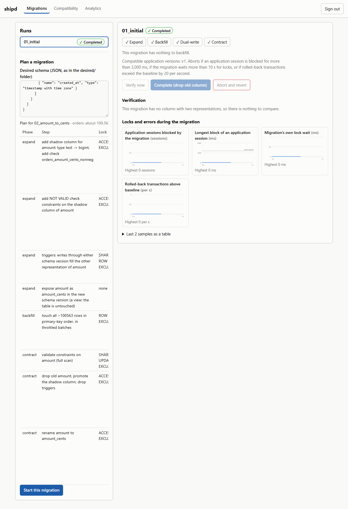
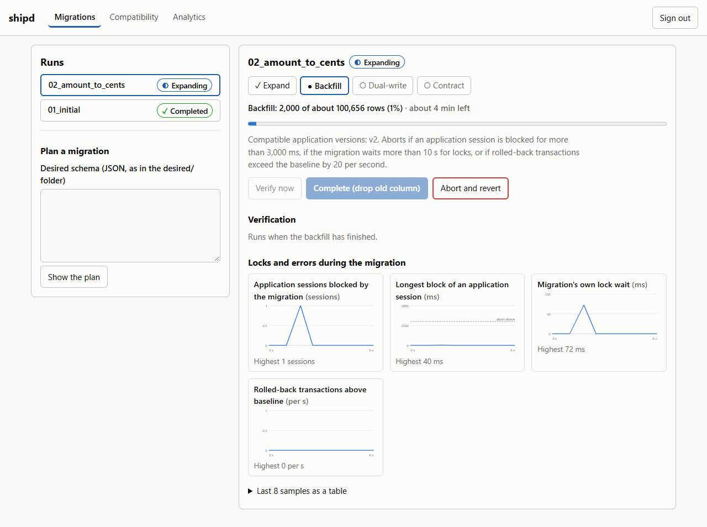
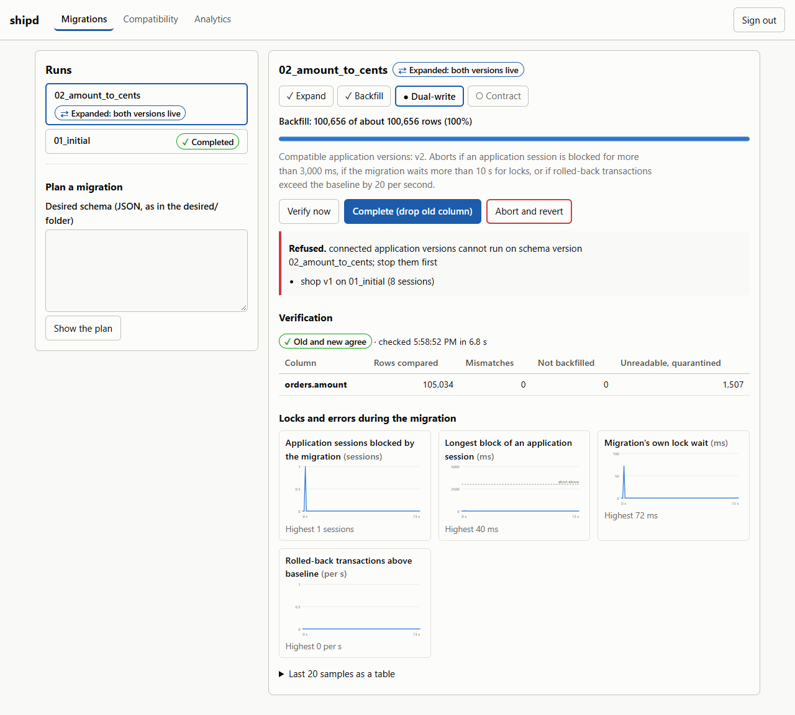
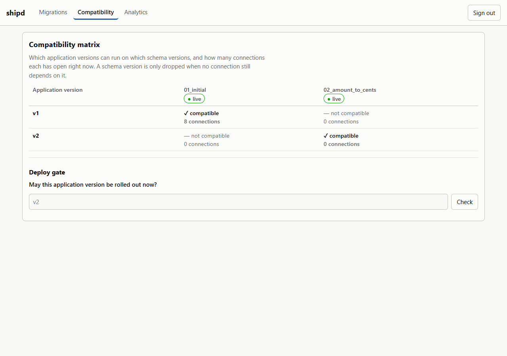

# shipd

Codetober day 05: SHIP.

A controller that changes a PostgreSQL schema while the application keeps writing to it.
You describe the schema you want; `shipd` diffs it against the live one, plans an
expand/contract migration, shows the locks each step takes, and drives it with
[pgroll](https://github.com/xataio/pgroll). A guard watches locks and errors the whole time
and reverts the migration if the application starts to suffer.

The demonstration is an order table whose `amount` column is free text (`"12.50"`, `"$12.50"`, `"12,50"`,
`"N/A"`) and has to become `amount_cents bigint`, while application version v1 keeps writing
text and v2 starts writing integers.

| | |
|---|---|
|  |  |
|  |  |

More in [docs/screenshots](docs/screenshots/), including the phone and dark layouts.

## How a migration runs

1. **Plan.** `POST /v1/plans` with a desired-schema file ([desired/](desired/)). The diff
   becomes pgroll operations plus a step list that names the lock each step needs and estimates
   the backfill from the table's size. A diff cannot tell a rename from a drop plus an add, so
   the file says `renamed_from`, and gives `up` and `down` SQL expressions for the value.
2. **Expand.** A shadow column, `NOT VALID` constraints and triggers go in; each schema version
   is a set of views, so v1 and v2 each see the column they expect and a write through either
   one fills the other. The existing rows are backfilled in primary-key order in throttled
   batches that slow down when the database does.
3. **Verify.** A full-table comparison of the old and new representation: mismatches,
   rows the backfill missed, and rows whose old value has no new form (those are copied to
   `shipd.quarantine`, not dropped).
4. **Contract.** Refused with a 409 while any connected application version cannot run on the
   new schema. Once they are gone, the old column, triggers and views are dropped in one
   transaction, so a writer sees the schema before or after and never in between.

At any point before contract, `abort` puts the schema back exactly as it was.

### The guard

Sampled throughout expand and contract; any breach aborts and reverts. All are per-migration
settings.

| Threshold | Default | Meaning |
|---|---|---|
| `max_lock_wait_ms` | 3000 | An application session was blocked by the migration for longer than this |
| `max_blocked` | 25 | More application sessions than this are blocked by the migration |
| `lock_budget_s` | 10 | Total time the migration itself may wait for locks |
| `max_rollbacks_per_s` | 20 | Rolled-back transactions per second above the pre-migration baseline |
| `lock_timeout_ms` | 1000 | Every migration statement gives up on its lock after this and retries |

One controller drives migrations at a time (an advisory lock). If it dies mid-migration, the
next one to start rolls the half-done change back.

## Measured

One recorded run of the full journey on a laptop, about 100,000 orders, with the controller
killed mid-backfill on purpose. The record is
[docs/evidence/drill-100k-kill.json](docs/evidence/drill-100k-kill.json).

| | |
|---|---|
| Writer errors, v1 and v2 | 0 |
| Wrong values read back | 0 of 74,959 rows cross-checked |
| Writes acknowledged during the migrations | 13,801 |
| Longest time the migration blocked an application session | 0 ms |
| Backfill of 101,635 rows under load | 101 s |
| After `docker kill` of the controller mid-backfill | replacement reverted the half-done migration within 13 s; the retry completed |
| Rows with an amount that has no integer form | 1,548, quarantined, 0 mismatches |
| v1 latency p50 / p99 / max | 23 ms / 488 ms / 5,407 ms |
| v2 latency p50 / p99 / max | 8 ms / 129 ms / 597 ms |

Latency is the writers' own measurement on a machine also running the database, the controller
and the backfill; the maximum is a single operation.

## Run it

Needs Docker with Compose v2.

```bash
cd SHIP
cp .env.example .env
docker compose up -d --build
```

First start creates the roles, applies schema version `01_initial`, generates and loads a
seeded order feed (`SEED_ORDERS`, default 1,000,000; set 100000 for a quick look) and starts
v1 writing. Everything is bound to 127.0.0.1.

| | |
|---|---|
| Console | <http://localhost:8089> (asks for a token from `.env`) |
| API and OpenAPI docs | <http://localhost:8088/docs> |
| Prometheus | <http://localhost:9099> |
| Grafana | <http://localhost:3099> (`admin` / `GRAFANA_ADMIN_PASSWORD`) |

Then either drive it from the console (Plan, paste [desired/02_amount_to_cents.json](desired/02_amount_to_cents.json),
start) and bring up the new application version when you are ready:

```bash
docker compose --profile v2 up -d shop-v2    # waits until its schema version is live
```

or let the drill do the whole journey with assertions (Node 20+, no packages):

```bash
docker compose down -v && docker compose up -d --build
node scripts/drill.mjs --kill-controller --out docs/evidence/drill.json
```

It exits non-zero if any writer saw an error or a wrong value, or any step did not go as
described.

## API

Generated from the code: [docs/openapi.json](docs/openapi.json), and a test fails if the
committed file is stale. Reads need the viewer or operator token, everything else the operator
token, as `Authorization: Bearer <token>`. Errors are RFC 9457 problem documents.

| | |
|---|---|
| `POST /v1/plans` | Plan a migration from a schema diff |
| `POST /v1/migrations` | Submit a migration and start expanding it (safe to retry) |
| `GET /v1/migrations`, `/v1/migrations/{id}` | Runs and their progress |
| `GET /v1/migrations/{id}/samples` | What the guard saw |
| `POST /v1/migrations/{id}/verify` | Compare old and new across every row |
| `POST /v1/migrations/{id}/complete` | Contract |
| `POST /v1/migrations/{id}/abort` | Revert |
| `GET /v1/compat`, `/v1/compat/check` | Which application versions run on which schema versions; the deploy gate |
| `GET /v1/analytics/duration-by-size`, `/v1/analytics/lock-waits` | Duration against table size, lock waits per run |
| `GET /healthz`, `/readyz`, `/metrics` | Liveness, readiness, Prometheus metrics |

The same engine is available from the command line: `shipd plan FILE`, `shipd apply FILE [--complete]`.

## Database roles

| Role | Can |
|---|---|
| `postgres` | Used once, by `shipd init`, to create the two roles below and pgroll's state |
| `ship_migrator` | Owns the schema, runs migrations, reads lock statistics. Not a superuser |
| `shop_app` | DML on the application tables, read on the compatibility matrix. No DDL |

## Data

`shop generate` writes a seeded order feed with the defects real feeds have: amounts spelled half a
dozen ways, status synonyms, four timestamp formats, bad emails, duplicates. `shop ingest`
validates every line at the boundary, quarantines what fails with a reason, and loads the rest
in one transaction per file. A file is identified by its hash, so loading it twice is a no-op.

## Tests

```bash
docker compose --profile test run --rm test      # gofmt, go vet, go test -race, against the db service
cd web && npm ci && npm run lint && npm test     # console: component tests
cd web/e2e && npm ci && npx playwright test      # the journey in a browser, against the running stack
```

Each integration test creates its own database and roles, so the suite does not disturb a
running stack. It covers a migration under live load, abort restoring the schema exactly,
revert on lock budget, on migration error and on error rate, and recovery from a crash
mid-backfill.

## Layout

| Path | |
|---|---|
| `cmd/shipd` | The controller: `serve`, `init`, `apply`, `plan`, `openapi` |
| `cmd/shop` | The application under migration: `generate`, `ingest`, `profile`, `run`, `wait-schema` |
| `internal/plan` | Schema diff to pgroll operations, steps, locks and estimate |
| `internal/engine` | Expand, verify, contract, the guard, crash recovery |
| `internal/api` | HTTP contract, token roles |
| `internal/shop` | Feed generator, validation, ingest, v1 and v2 writers |
| `desired/`, `migrations/` | Desired schemas and the migrations planned from them |
| `web/` | Console (React, TypeScript) and its end-to-end test |
| `deploy/` | Prometheus scrape config and alerts, Grafana dashboard |
